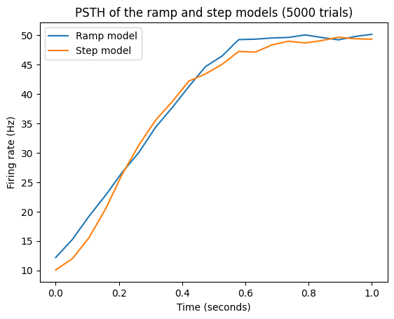
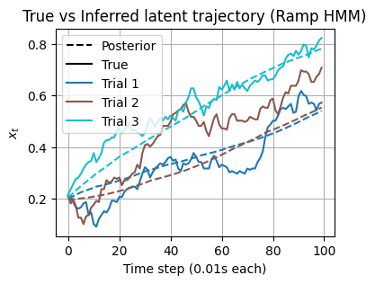
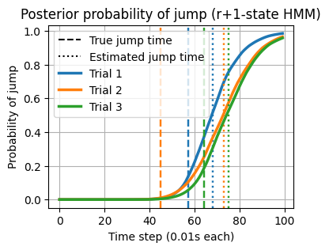
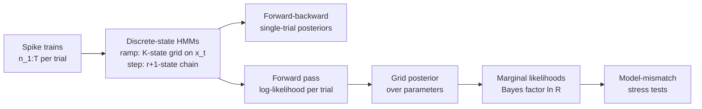

# Ramping or Stepping? Bayesian Model Selection for Neural Spike Trains

This project uses hidden Markov models and Bayes factors to test whether decision-related neurons in macaque area LIP integrate evidence by ramping or jump in discrete steps, working from spike trains alone, and measures how reliably that inference recovers the true model on simulated data.

<p align="center">
  
  <br><em>Averaged over 5,000 trials, the ramp and step models give nearly identical firing-rate profiles. Telling them apart needs single-trial, likelihood-based inference.</em>
</p>

## Overview

Neurons in the lateral intraparietal area (LIP) show ramping trial-averaged activity during perceptual decisions. That is classically read as evidence accumulation, but Latimer et al. (*Science*, 2015) argued that single-trial activity is better described by a discrete **step** at a random time. The distinction matters scientifically: ramping implies LIP accumulates evidence, while stepping suggests it reports a decision made upstream. Because trial-averaged statistics barely separate the two, this project builds the full probabilistic pipeline. It casts both hypotheses as discrete-state HMMs, infers latent trajectories on single trials, computes grid posteriors over parameters, and performs Bayesian model selection. It then stress-tests that selection under model mismatch.

## Key results

- **Bayesian model selection across 2,000 evaluations:** 50 simulated datasets per model × 4 trial counts × 5 priors. Each Bayes factor marginalises over a 160-point parameter grid (6×10 step, 10×10 ramp). With 400 trials per dataset and a uniform prior, **98 % of ramp datasets and 82 % of step datasets are correctly identified**.
- **Accuracy scales with data:** as trials per dataset go from 25 to 400, step-model recovery improves from 72 % to 82 % while ramp recovery stays at 92–98 %. The errors are asymmetric: step datasets are more often mistaken for ramps than the reverse.
- **Robustness to non-Poisson spiking:** with gamma-renewal (sub-Poisson) spiking unaccounted for in the likelihood, misclassification rates did not grow. At 25 trials, errors were 12 % / 12 % (step / ramp) under Poisson spiking and 5–11 % / 1–3 % for gamma shapes 2–5 (100 datasets per model per shape).
- **Likelihood-free baseline:** a classifier built on first- and second-order statistics (Fano-factor sum and max, mean and variance, PCA) with a hand-set decision boundary separated 89 % of step and 81 % of ramp datasets (in-sample, 300 datasets per model). This is the benchmark the Bayesian approach is measured against.

| Trials per dataset | Ramp correctly identified | Step correctly identified |
|---:|---:|---:|
| 25 | 92 % | 72 % |
| 50 | 94 % | 76 % |
| 100 | 92 % | 80 % |
| **400** | **98 %** | **82 %** |

<sub>Uniform prior over the parameter grid, 50 datasets per model, $T = 100$ time bins. Parameters were drawn uniformly: $m \in [1, 75)$, $r \in \{1,\dots,6\}$, $\beta \in [0, 4]$, $\ln\sigma \in [\ln 0.04, \ln 4]$.</sub>

<p align="center">
  
  
</p>

## Method



**Ramp model as an HMM.** The drift-diffusion latent $x_{t+1} = x_t + \beta\,dt + \sigma\sqrt{dt}\,\epsilon_t$, with a reflecting bound at 0 and an absorbing bound at 1, is discretised onto $K$ grid points. Each row of the transition matrix is obtained by integrating the Gaussian transition density over the bins around each grid point. Emissions are Poisson with rate $R_h x_t$.

**Step model as an exact HMM.** Jump times are negative-binomial, $\mathrm{NB}(m, r)$. A two-state chain can only produce geometric waiting times, so the step model is written as an $(r{+}1)$-state chain with advance probability $p = r/(m+r)$, which reproduces the NB jump-time distribution exactly, up to a known $r$-step delay. To compare likelihoods on the same $T$ observed bins, $r$ observation-free rows are prepended to the log-likelihood matrix.

**Inference.** Forward-backward gives $P(s_t \mid n_{1:T})$, the posterior-mean latent path $\mathbb{E}[x_t \mid n_{1:T}]$, and the posterior probability that the step has occurred. Summing per-trial log-likelihoods over a parameter grid (using $\ln\sigma$ for the ramp) gives the unnormalised posterior. Posterior means and variances are computed stably with `logsumexp`.

**Model selection.** $\ln R = \ln P(\text{data}\mid\text{ramp}) - \ln P(\text{data}\mid\text{step})$, where each marginal likelihood is a `logsumexp` of grid log-likelihood plus log-prior. The study compares uniform priors with truncated-Gaussian priors of varying width. The dataset × prior × trial-count sweep is parallelised across CPU cores with `joblib`.

**Model mismatch.** Spikes are generated from a gamma-ISI renewal process (shape 1–5) while inference still assumes Poisson emissions. This measures how an unmodelled assumption biases the conclusion.

## Repository structure

```
bayesian-neural-dynamics/
├── ramp_vs_step.ipynb  # all analysis: simulation, HMMs, inference, model selection, mismatch
├── models.py           # StepModel / RampModel spike-train simulators (provided)
└── inference.py        # Numba-JIT forward-backward, Viterbi, Poisson log-pdf (provided, after SSM)
```

## Reproducing

```bash
uv run --with numpy --with scipy --with matplotlib --with numba --with scikit-learn \
       --with joblib --with tqdm --with tqdm-joblib --with requests --with jupyterlab \
       jupyter lab ramp_vs_step.ipynb
```

Set `mode = "local"` in the import cells so that the bundled `models.py` and `inference.py` are used instead of being downloaded. The full model-selection sweep evaluates thousands of HMM likelihood grids. It uses all available cores (`n_jobs=-1`) and takes a while.

## Tech stack

Python 3.12 · NumPy · SciPy (`norm`, `logsumexp`) · Numba (JIT HMM kernels) · joblib (parallel sweeps) · scikit-learn (PCA) · Matplotlib · Jupyter

## Acknowledgements

Joint work with [@ericyh](https://github.com/ericyh). Originally developed for GG3 Neural Data Analysis, Department of Engineering, University of Cambridge (2025), led by Yashar Ahmadian, who provided the problem framing and background text, the simulators (`models.py`) and the HMM inference kernels (`inference.py`, adapted from Linderman et al.'s [SSM](https://github.com/lindermanlab/ssm)). The HMM formulations, inference and model-selection experiments in the notebook are our own work.
